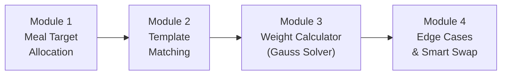

# Báo cáo Chi tiết: Thuật toán Gợi ý Thực đơn (Hybrid Raw-Food Recommendation Algorithm)

Thuật toán Gợi ý Thực đơn (hay còn gọi là Gauss Meal Solver) là trái tim của hệ thống Nutrition Management System (NMS), được thiết kế với triết lý **Hardcore Tracking**. Thay vì gợi ý các món ăn đã nấu chín với lượng calo ước tính thiếu chính xác, hệ thống tính toán trực tiếp trọng lượng của từng nguyên liệu thô (raw ingredients) để đảm bảo đáp ứng chính xác 100% mục tiêu Macro của người dùng.

Dưới đây là báo cáo phân tích chi tiết về kiến trúc, cơ sở toán học và cơ chế xử lý ngoại lệ của thuật toán này, được tổng hợp từ kế hoạch ban đầu và thực tế triển khai trong mã nguồn (`mealPlanner.service.js`).

---

## 1. Tổng quan Kiến trúc (4 Modules)

Luồng hoạt động của thuật toán được chia làm 4 module nối tiếp nhau:

### Module 1: Phân bổ Mục tiêu Bữa ăn (Meal Target Allocation)
* **Chức năng:** Chuyển đổi mục tiêu Calo/Macro tổng của một ngày thành mục tiêu cụ thể cho từng bữa ăn.
* **Đầu vào:** Mục tiêu TDEE/Macro hàng ngày và Cấu hình phân bổ bữa ăn (Ví dụ: Sáng 25%, Trưa 35%, Tối 30%, Phụ 10%).
* **Đầu ra:** Ngân sách chính xác bằng Gram cho Protein, Carbs, Fat của bữa ăn đang xét.

### Module 2: Khớp Khuôn mẫu (Template Matching)
* **Chức năng:** Chọn các nguyên liệu thô phù hợp để điền vào "Khuôn mẫu" (Template) của bữa ăn.
* **Cơ chế:** Một bữa ăn tiêu chuẩn được giới hạn nghiêm ngặt ở **4 Slot** (1 Carb, 1 Protein, 1 Fat, 1 Rau/Fiber). Hệ thống sẽ truy vấn CSDL để chọn ngẫu nhiên (hoặc theo sở thích) các thực phẩm tương ứng với từng Slot.

---

## 2. Cốt lõi Toán học: Bộ tính khối lượng (Weight Calculator)

Bài toán khó nhất ở đây là **Macro Overlap** (Chồng lấn đa lượng). Một nguyên liệu thô thường chứa nhiều macro (ví dụ: gạo lứt chứa cả Carbs và Protein). Không thể tính đơn giản bằng phép chia, mà phải giải một hệ phương trình.

### 2.1. Lập Hệ Phương Trình Tuyến Tính
Giả sử có 3 nguyên liệu (Carb, Protein, Fat) với trọng lượng cần tìm là `w1, w2, w3` (tính theo đơn vị phần 100g). Mỗi nguyên liệu có thành phần `(pi, ci, fi)` trên 100g.

Mục tiêu của bữa ăn là `Tp, Tc, Tf`. Ta có hệ 3 phương trình:
1. `p1*w1 + p2*w2 + p3*w3 = Tp`
2. `c1*w1 + c2*w2 + c3*w3 = Tc`
3. `f1*w1 + f2*w2 + f3*w3 = Tf`

*Lưu ý về Slot Rau (Fiber):* Để duy trì hệ 3x3 (giải được nghiệm duy nhất), thuật toán "chốt" (pin) khối lượng rau ở mức cố định là **200g**. Lượng macro từ 200g rau này được trừ thẳng vào mục tiêu `(Tp, Tc, Tf)` trước khi đưa vào giải hệ.

### 2.2. Giải Hệ bằng Thuật toán Khử Gauss (Gaussian Elimination)
Hệ thống sử dụng ma trận `3x3` và áp dụng phương pháp Khử Gauss kết hợp **Partial Pivoting**.
* **Partial Pivoting (Hoán vị dòng):** Luôn tìm phần tử có giá trị tuyệt đối lớn nhất trong cột để đưa lên làm phần tử chéo chính. Điều này giúp tránh chia cho 0 và giảm thiểu sai số dấu phẩy động (floating-point error).
* **Forward Elimination:** Biến đổi ma trận về dạng tam giác trên.
* **Back Substitution:** Giải ngược từ dưới lên để tìm ra chính xác `(w1, w2, w3)`.

*Nếu định thức của ma trận bằng 0 (Singular Matrix - các nguyên liệu có tỷ lệ macro quá giống nhau), thuật toán trả về `null`.*

---

## 3. Xử lý Ngoại lệ và Trải nghiệm Người dùng (Module 4)

Toán học luôn đúng, nhưng thực tế dinh dưỡng thì không. Sẽ có những lúc hệ phương trình cho ra kết quả phi thực tế (Ví dụ: Trọng lượng là số âm).

### 3.1. Nhận diện Ngoại lệ (Edge Cases)
Thuật toán có một bộ lọc kiểm tra (Validation Pipeline) để phát hiện các bất thường:
* **Khối lượng Âm (`NEGATIVE_WEIGHT`):** Xảy ra khi một nguyên liệu chứa quá nhiều macro sai nhóm. Ví dụ: Dùng "Thịt ba chỉ" để lấy Protein, nhưng nó quá nhiều mỡ, khiến hệ thống tính ra dầu ăn phải là số ÂM để bù trừ.
* **Quá ít (`TOO_SMALL`):** `< 10g` - không bõ để nấu nướng.
* **Quá nhiều (`TOO_LARGE`):** `> 500g` - lượng thức ăn quá lớn cho một bữa.
* **Ma trận suy biến (`det(A) = 0`):** Tổ hợp nguyên liệu không thể cân bằng.

### 3.2. Cơ chế Smart Swap thay vì Heuristic Fallback
Trong quá trình phát triển, dự án đã **loại bỏ hoàn toàn thuật toán dự phòng (Heuristic Fallback)** — thuật toán vốn cố gắng "bóp méo" số liệu để cho ra một thực đơn xấp xỉ nhưng sai mục tiêu.

Thay vào đó, triết lý **Hardcore Tracking** được áp dụng thông qua **Smart Swap**:
* Khi tính ra nghiệm âm, thay vì che giấu, thuật toán chặn lại và thông báo rõ nguyên nhân (Ví dụ: *"Nguồn đạm mới đã vượt ngân sách chất béo"*).
* Hệ thống trao quyền cho người dùng tự thay đổi thực phẩm thông qua tính năng đổi món (Swap), đồng thời gợi ý các lựa chọn nạc hơn (Ví dụ: Ức gà, Cá ngừ). Điều này vừa đảm bảo tính chính xác tuyệt đối của toán học, vừa giáo dục kiến thức dinh dưỡng cho người dùng.

---

## 4. Tổng kết

Sự kết hợp giữa **Toán học tuyến tính (Gauss)** và **Nhận thức UX (Smart Swap)** giúp thuật toán Meal Planner của NMS không chỉ chính xác đến từng gram mà còn hoạt động như một chuyên gia dinh dưỡng thực thụ, hướng dẫn người dùng lựa chọn thực phẩm phù hợp nhất với cơ địa của họ.
